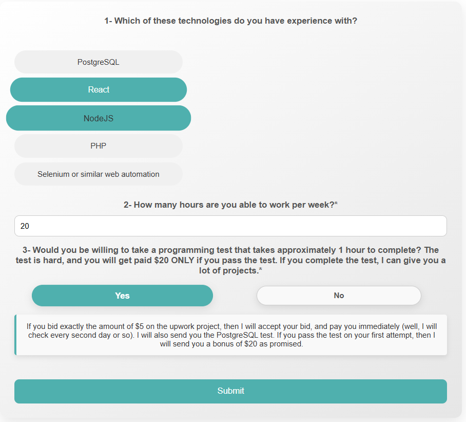
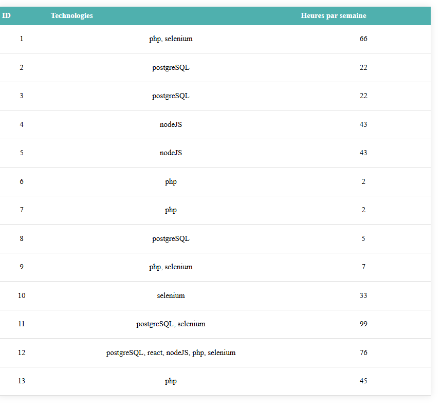

# form

Form (Responsive)

How to Clone the Project
1-Run the following command to clone the repository:
git clone https://github.com/Meddebsofien/form.git
2-Navigate to the server folder:
cd server
3-Install the necessary dependencies:
npm i
4-Start the server:
npm run dev
5-Open another terminal and navigate to the frontend folder:
cd frontend
6-Install the frontend dependencies:
npm i
7-Start the frontend server:
nodemon index
8-Open your browser and visit the following link:
http://localhost:5173/
9-To view the user list, go to:
http://localhost:5173/users

